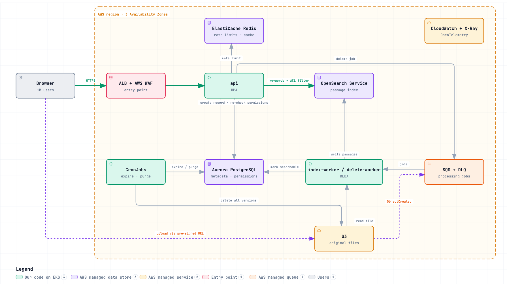
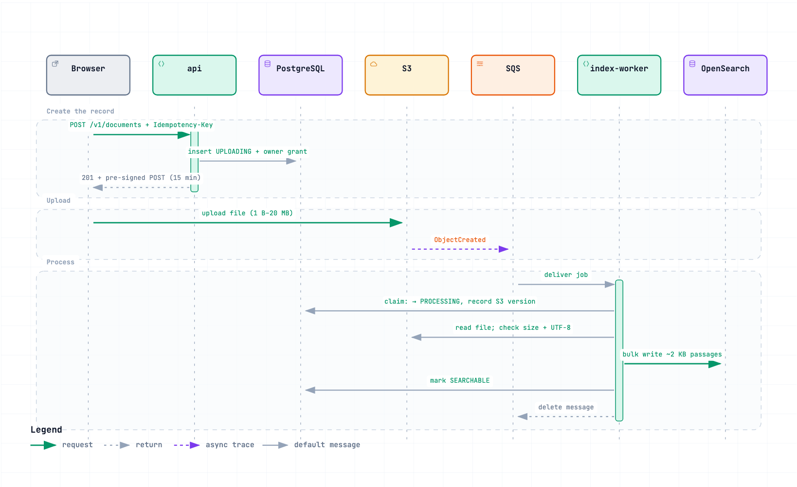
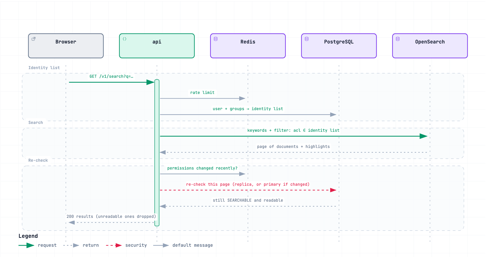
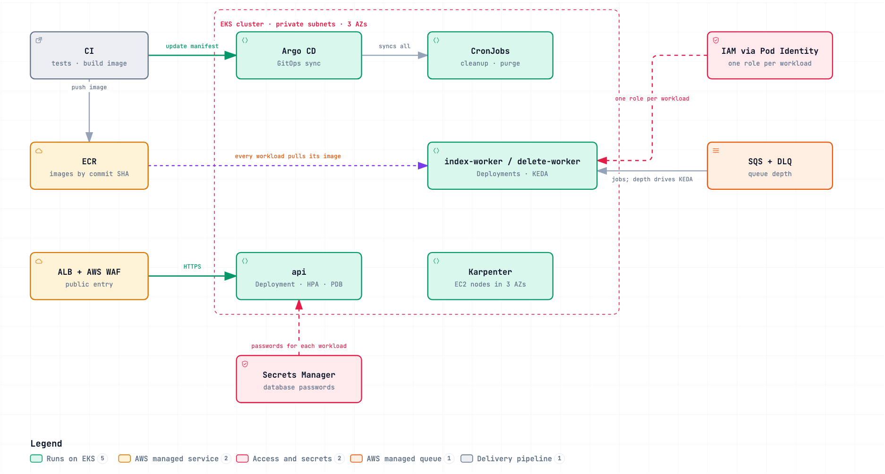

# 練習二：分散式文件搜尋平台

[English](README.md) · **繁體中文**

> 這是英文版 [README.md](README.md) 的中文對照版，兩份內容相同；如有出入，以英文版為準。圖中的文字是英文。

這是一個讓使用者上傳、閱覽、搜尋、刪除文字文件的平台設計，規模是 100 萬使用者、1,000 萬份文件、每秒 3,000 次搜尋。這份是設計文件加上圖，沒有程式碼。

**一段話說完：** 檔案從瀏覽器直接傳到 S3；S3 接著把工作放進佇列，worker 把每份文件切成小段落，寫進 OpenSearch 建立索引。每份文件的狀態和權限都存在 PostgreSQL，而且它永遠是正本，所以搜尋結果在給使用者看之前，都會再用它確認一次。每個背景步驟都可以安全地重複執行，重試和程式當掉就是靠這一點處理。

**圖：** 頁面裡顯示的是圖片。每張圖也有可互動的 HTML 版本；GitHub 會把 HTML 檔顯示成原始碼，所以要下載下來，用瀏覽器開啟才能使用。

## 目錄

- **基礎：** [假設](#假設) · [容量估算](#容量估算) · [高層架構](#高層架構)
- **資料與 API：** [API 設計](#api-設計) · [核心資料模型](#核心資料模型) · [文件與中繼資料的儲存](#文件與中繼資料的儲存)
- **資料怎麼流動：** [上傳與非同步處理](#上傳與非同步處理) · [佇列重試與死信佇列](#佇列重試與死信佇列) · [索引與一致性](#索引與一致性) · [權限過濾](#權限過濾)
- **營運：** [擴展](#擴展) · [部署](#部署) · [可觀測性](#可觀測性)
- **答案：** [討論情境](#討論情境) · [取捨與其他選項](#取捨與其他選項)

## 假設

題目給了規模和需求。以下都是我為了讓設計具體而補上的假設。

- **登入**不在題目範圍內，所以當成一個獨立的元件處理：每個請求到達 API 時，都帶著一個識別使用者的已簽章 JWT（實務上由 Amazon Cognito 這類身分服務簽發）。API 只驗證 JWT，並從中取出使用者 ID。
- **權限模型：** 每份文件有一個擁有者。擁有者可以把文件以唯讀方式分享給個別使用者或群組。一個人可以屬於多個群組，一般使用者大約屬於幾個到幾十個。
- **文件是純文字（UTF-8）。** 要支援 PDF 或其他格式，只要在 worker 加一個擷取文字的步驟，其他都不用改。
- **單一檔案上限 20 MB**，是平均 2 MB 的 10 倍。一本長篇小說的純文字也只有幾 MB。
- **文件切成約 2 KB 的段落來建立索引**（約 680 個中文字，或 300～350 個英文單字），相鄰段落重疊約 100 字，避免一個詞組被切成兩半。
- **搜尋是關鍵字搜尋**，不是語意搜尋。
- **容量規劃到目前的 2 倍**（2,000 萬份文件），因為有些決定（例如搜尋 shard 的數量）之後很難改。
- **題目給的數字是尖峰值。** 平時流量低很多。
- **沒有審核或內容管理流程。** 文件處理完成後，有權限的人立刻就能搜到。
- **刪除後無法復原。** 文件在使用者端立即消失，搜尋資料幾秒內清除，原始檔案（S3 的每個版本）和中繼資料由下一次每日清除排程永久刪除，也就是約一天內。刪除紀錄會保留在稽核紀錄裡：題目沒有要求，但成本低，而且有人問「文件去哪了」時，這是唯一留下的證據。還原刪除的文件不在需求內，所以不提供。
- **單一 AWS 區域、三個可用區（AZ）。** 多區域不在範圍內。

## 容量估算

以下是數量級的估算。題目給的數字：100 萬使用者、1,000 萬份文件、平均 2 MB、尖峰每秒上傳 100 份、搜尋 3,000 次、搜尋要在 500 ms 內完成、上傳後 5 分鐘內可搜尋。估算時 1 KB ≈ 1,000 bytes；UTF-8 中一個中文字佔 3 bytes。

### 結果

| 元件 | 目前 | 2 倍時 |
|---|---|---|
| S3（原始檔案） | 約 20 TB | 約 40 TB |
| PostgreSQL（中繼資料） | < 50 GB；1 台主資料庫 + 2 台讀取副本 | < 100 GB |
| OpenSearch 段落數 | 約 100 億 | 約 200 億 |
| OpenSearch 磁碟（3 份 + 預留空間） | 約 100 TB | 約 200 TB |
| OpenSearch primary shard 數 | 1,000（每個約 25 GB） | 1,000（每個約 50 GB） |
| OpenSearch 資料節點 | 約 40 台，加 3 台專用 master | 約 80 台 |
| 尖峰時的 worker Pod | 約 40 | |
| 尖峰時的 API Pod | 約 20 | |

### 數字怎麼算出來

**儲存**

```
原始檔案      1,000 萬份 × 2 MB                         = 20 TB
每份的段落數  2 MB ÷ 2 KB                               ≈ 1,000
段落總數      1,000 萬 × 1,000                          = 100 億（重疊再多約 15%）
```

**PostgreSQL**

```
documents         1,000 萬筆 × 約 1 KB                       ≈ 10 GB
document_grants   1,000 萬份 × 約 3 筆授權 × 約 100 B        ≈ 3 GB
group_members     100 萬人 × 約 10 個群組 × 約 100 B         ≈ 1 GB
尖峰寫入          每秒 100 份上傳 × 約 5 次寫入              ≈ 每秒 500 次  → 主資料庫
尖峰讀取          每秒 3,000 次搜尋 × 2 次查詢               ≈ 每秒 6,000 次 → 讀取副本
```

**OpenSearch**

```
儲存的原文（_source）   20 TB，壓縮到約一半                       ≈ 10 TB    （估計）
倒排索引                 跟原文同一個量級                          ≈ 10–15 TB （估計）
每個段落的欄位           100 億 × 約 200 B                         ≈ 2 TB
primary 資料                                                       ≈ 25 TB
3 份（1 份 primary + 2 份副本，每個 AZ 一份）                      ≈ 75 TB
磁碟最多用到約 75%（分配門檻、segment 合併需要空間）               ≈ 100 TB
primary shard 數   2 倍成長：50 TB ÷ 每個 shard 50 GB              = 1,000
資料節點           100 TB ÷ 每台約 2.5 TB 可用空間                 ≈ 40
尖峰寫入           每秒 100 份 × 1,000 段                          = 每秒 10 萬段（約 200 MB/s 的文字）
```

**Worker 與 API**

```
Worker   每秒 100 份 × 每份約 2 秒 = 同時處理 200 份 ÷ 每個 Pod 10 份 = 20 個 Pod → 加餘裕約 40 個
API      每秒 3,000 次搜尋 ÷ 每個 Pod 約 300 次      = 10 個 Pod → 加餘裕約 20 個
```

### 時間預算

| 搜尋（500 ms） | 預算 |
|---|---|
| 負載平衡器 + API | 約 20 ms |
| 查使用者所屬的群組 | 約 5 ms |
| OpenSearch 查詢 | ≤ 300 ms |
| 回到 PostgreSQL 再確認權限 | 約 10 ms |
| 保留 | 約 165 ms |

| 上傳到可搜尋（5 分鐘） | 預算 |
|---|---|
| S3 事件 → 佇列 | 幾秒 |
| 在佇列排隊 | < 1 分鐘 |
| 處理 | 幾秒 |
| OpenSearch refresh | ≤ 30 秒 |
| **一般合計** | **約 1 分鐘**；佇列塞車時也在 2 分鐘內；最舊的訊息等超過 3 分鐘就告警 |

### 瓶頸在搜尋，不在儲存

文件可以分享給任何人，所以一個使用者能讀的段落分散在所有 shard 上，每次搜尋都要問過每一個 shard：

```
每秒 3,000 次搜尋 × 1,000 個 shard = 每秒 300 萬次 shard 查詢
```

這就是 shard 要開大一點（每次搜尋要問的 shard 比較少）、副本數依查詢量而不是依儲存量決定的原因。約 40 台資料節點只是起點，最後的數字由下面的壓測決定。

### 哪些是估計值以及怎麼驗證

OpenSearch 的大小和單一 shard 的查詢成本，很大程度取決於中文切詞和壓縮率。每份文件的處理時間、單一 API Pod 能撐多少請求，也都是估計值。我會用約 1 萬本真實書籍建立索引，量測索引大小和單一 shard 的查詢延遲，並對 API 做壓測，再按比例推算全量。

## 高層架構

[](diagrams/high-level-architecture.html)

互動版（下載後用瀏覽器開啟）：[`diagrams/high-level-architecture.html`](diagrams/high-level-architecture.html)。原始設定：[`diagrams/high-level-architecture.json`](diagrams/high-level-architecture.json)。

**分工：** 我們自己寫的無狀態程式跑在 Kubernetes（Amazon EKS）上；凡是存資料的都交給 AWS 託管服務。程式出問題時直接換掉 Pod 就好，資料服務的備份、複製和故障轉移則由 AWS 處理。

### 元件

| 元件 | 做什麼 | 為什麼選它 |
|---|---|---|
| **ALB + AWS WAF** | 入口：TLS、負載平衡、基本的機器人和頻率規則 | 託管的負載平衡器，EKS 可以直接設定它（AWS Load Balancer Controller） |
| **`api`**（EKS） | 權限檢查、搜尋、分享、簽發上傳和下載連結、刪除（標記為已刪除並送出刪除工作） | 無狀態，所以可以依 CPU 用 HPA 水平擴展 |
| **`index-worker`、`delete-worker`**（EKS） | 處理佇列裡的工作：`index-worker` 建立搜尋資料並改寫段落上的權限；`delete-worker` 刪除搜尋資料 | 用 KEDA 依佇列長度擴展，閒置時縮到最小數量 |
| **CronJobs**（EKS） | 每 5 分鐘：讓逾期的上傳過期，並計算卡住的文件供告警使用。每天：永久刪除已刪除的文件（在搜尋資料清除後），以及超過 7 天的逾期或失敗文件，包括 S3 的每個版本（依版本 ID 刪除）和中繼資料 | 簡單的排程工作，跟其他程式放在一起 |
| **S3** | 原始檔案 | 耐久又便宜；presigned URL 讓瀏覽器直接上傳和下載，檔案流量完全不經過 API；檔案到達時會送出事件 |
| **Aurora PostgreSQL** | 中繼資料、權限、文件狀態 | 交易和條件更新支撐文件的狀態機；讀取副本負責權限確認 |
| **SQS Standard + DLQ** | 處理工作 | 重試和死信佇列（DLQ）都是內建的；worker 是冪等的，所以不需要佇列保證順序或只送一次 |
| **OpenSearch Service** | 段落索引：關鍵字搜尋、權限過濾、高亮段落 | 在這個規模下提供全文搜尋、過濾和高亮，並由 AWS 跨三個 AZ 託管 |
| **ElastiCache Redis** | 頻率限制、短期的搜尋快取、最近的權限變更 | 所有 API Pod 共用的快速狀態 |
| **CloudWatch + X-Ray**（透過 OpenTelemetry / ADOT） | log、指標、trace、告警 | AWS 原生；OpenTelemetry 讓程式碼不綁定監控廠商 |

### 不綁定 AWS

這個設計依賴的是「能力」，不是 AWS 特有的功能。任何提供這些能力的平台，換上對應的服務就能執行：

| 需要的能力 | AWS | 其他選擇 |
|---|---|---|
| 支援 presigned URL 和「物件建立」事件的物件儲存 | S3 | Google Cloud Storage、Azure Blob Storage |
| 支援交易的關聯式資料庫 | Aurora PostgreSQL | Cloud SQL、Azure Database for PostgreSQL |
| 至少送一次、有重試和死信佇列的佇列 | SQS | Pub/Sub、Azure Service Bus、RabbitMQ |
| 支援過濾和高亮的搜尋引擎 | OpenSearch Service | Elasticsearch（Elastic Cloud） |
| 託管 Kubernetes | EKS | GKE、AKS |

### 請求路徑

- **搜尋：** 瀏覽器 → ALB → `api` → 頻率限制（Redis）→ OpenSearch（關鍵字 + 權限過濾）→ `api` 回到 PostgreSQL 再確認權限 → 回傳附高亮段落的結果。
- **上傳：** 瀏覽器 → `api` 建立文件紀錄並回傳 presigned 上傳連結 → 瀏覽器直接傳到 S3 → S3 事件 → SQS。
- **背景處理：** SQS → `index-worker` → 從 S3 讀取檔案 → 把段落寫進 OpenSearch → 在 PostgreSQL 把文件標記為可搜尋。
- **刪除：** `api` 在 PostgreSQL 把文件標記為已刪除（立即看不到）並送出刪除工作 → `delete-worker` 從 OpenSearch 刪除段落 → 下一次每日清除排程刪除 S3 的每個版本和中繼資料。

每條路徑在後面的章節都有詳細說明。

## API 設計

REST + JSON，路徑以 `/v1` 開頭。每個請求都帶著登入元件提供的 JWT（`Authorization: Bearer <JWT>`）；API 只驗證它，並取出使用者 ID。ID 使用 ULID（可排序，而且不會洩漏文件總數）。

### 端點

| 方法與路徑 | 做什麼 | 誰可以呼叫 |
|---|---|---|
| `POST /v1/documents` | 建立文件並取得 presigned 上傳連結 | 任何已登入的使用者 |
| `GET /v1/documents?scope=owned\|shared&cursor=` | 列出我的文件，或分享給我的文件 | 任何已登入的使用者 |
| `GET /v1/documents/{docId}` | 文件資訊和狀態 | 擁有者、讀者 |
| `GET /v1/documents/{docId}/download` | 取得短效的下載連結 | 擁有者、讀者 |
| `DELETE /v1/documents/{docId}` | 刪除：立即看不到，約一天內永久清除 | 擁有者 |
| `GET /v1/documents/{docId}/grants` | 列出分享對象 | 擁有者 |
| `PUT /v1/documents/{docId}/grants/{user\|group}/{id}` | 分享給使用者或群組（唯讀） | 擁有者 |
| `DELETE /v1/documents/{docId}/grants/{user\|group}/{id}` | 取消分享 | 擁有者 |
| `POST /v1/groups`、`GET /v1/groups` | 建立群組（建立者成為唯一的管理者）；列出我的群組 | 任何已登入的使用者 |
| `PUT` / `DELETE /v1/groups/{groupId}/members/{userId}` | 加入或移除成員 | 群組管理者（建立者） |
| `GET /v1/search?q=&page=&pageSize=` | 在我能讀的文件裡做關鍵字搜尋 | 任何已登入的使用者 |

### 建立文件

```http
POST /v1/documents
Authorization: Bearer <JWT>
Idempotency-Key: 01J9ZQ…            （由客戶端產生，重送時沿用）

{ "title": "Quantum Mechanics", "filename": "quantum.txt", "sizeBytes": 2097152, "contentType": "text/plain" }
```

```json
201 Created
{
  "docId": "01J9ZK…",
  "status": "UPLOADING",
  "upload": {
    "url": "https://<bucket>.s3.amazonaws.com/",
    "fields": { "key": "docs/01J9ZK…/v1", "policy": "…", "x-amz-signature": "…" },
    "expiresAt": "2026-10-07T08:15:00Z"
  }
}
```

用同一個 `Idempotency-Key` 重送，會拿到同一個 `docId`，不會建立第二份文件。

### 搜尋

```json
GET /v1/search?q=quantum&page=1&pageSize=10

200 OK
{
  "results": [
    {
      "docId": "01J9ZK…",
      "title": "Quantum Mechanics",
      "passages": [ { "chunkNo": 7, "highlight": "<em>Quantum</em> mechanics studies very small particles…" } ]
    }
  ],
  "page": 1,
  "pageSize": 10,
  "approxTotal": 128
}
```

每份文件只出現一次，最多附 3 個符合的段落。

### 所有端點的共通規則

| 規則 | 理由 |
|---|---|
| 錯誤格式是 `{"error": {"code", "message", "requestId"}}`；`requestId` 就是 trace ID | 使用者回報時附上它，我們一次就能查到完整的 trace |
| **沒有權限回 `404`，不回 `403`** | 回 `403` 等於承認這份文件存在 |
| 宣告的大小超過 20 MB 回 `413` | 上傳連結本來就會拒絕，提早失敗 |
| 被限流時回 `429` 並附 `Retry-After` | 客戶端知道什麼時候可以重試 |
| `POST /v1/documents` 必須帶 `Idempotency-Key`；`PUT` 和 `DELETE` 本身就是冪等的 | 重試不會產生重複資料 |
| 列表用 cursor 分頁；搜尋用頁碼分頁（每頁最多 20 筆、最多 100 頁） | 列表來自 PostgreSQL，cursor 比較穩定；搜尋由 OpenSearch 依相關度排序 |
| 高亮內容先做 HTML 跳脫，再加上 `<em>` 標記 | 文件內容是使用者上傳的，可能藏有 script 標籤 |

## 核心資料模型

### 文件狀態

```
POST /documents
      │
      ▼
  UPLOADING ── 已過期限、S3 沒有檔案（清理排程）    ──▶ EXPIRED
            └─ 檔案在期限後超過 10 分鐘才到（worker）──▶ EXPIRED
      │ S3 事件
      ▼
  PROCESSING ── 內容檢查失敗 ──▶ FAILED
      │
      ▼
  SEARCHABLE

  UPLOADING / PROCESSING / SEARCHABLE / FAILED ── DELETE ──▶ DELETED ── 每日清除 ──▶ 永久刪除
  EXPIRED / FAILED ── 7 天後由每日清除處理 ──▶ 永久刪除
```

每次狀態變更都是條件更新，例如 `UPDATE documents SET status = 'PROCESSING' WHERE id = $1 AND status = 'UPLOADING'`。兩個 worker 同時搶時，只有一個會更新成功；另一個看到更新了 0 筆就停止。唯一的例外是接手當掉的 worker，說明在上傳流程。

### PostgreSQL（正本）

```sql
users           (id PK, email UNIQUE, display_name, created_at)
groups          (id PK, name, admin_id, created_at)              -- admin_id：建立者，唯一能加入或移除成員的人
group_members   (group_id, user_id,
                 PRIMARY KEY (group_id, user_id))                 -- 一個人可以屬於多個群組

documents       (id PK, owner_id, title, original_filename, size_bytes,
                 status,                                          -- 上面的狀態機
                 acl_version,                                     -- 每次分享變更就加一
                 s3_key, s3_version_id,                           -- 實際處理的檔案版本
                 claimed_at,                                      -- worker 認領的時間（用於當掉後接手）
                 search_cleared_at,                               -- delete-worker 設定；清除排程等它
                 idempotency_key, UNIQUE (owner_id, idempotency_key),
                 upload_expires_at, uploaded_at, searchable_at, deleted_at,
                 failed_reason, created_at, updated_at)

document_grants (doc_id, principal_type, principal_id, permission, -- 'user' | 'group'；'owner' | 'viewer'
                 PRIMARY KEY (doc_id, principal_type, principal_id))

audit_log       (id PK, actor_id, action, doc_id, created_at)     -- 刪除、清除、分享變更
outbox          (id PK, doc_id, action, trace_context, created_at, sent_at)  -- 等待送到 SQS 的訊息
```

主要索引：`documents (owner_id, created_at)` 給「我的文件」用，`document_grants (principal_type, principal_id)` 給「分享給我的文件」用，`group_members (user_id)` 用來查一個人屬於哪些群組，另外對 `UPLOADING` 和 `DELETED` 的資料建部分索引，給排程工作使用。

### OpenSearch 段落索引（衍生的副本）

每個約 2 KB 的段落一筆：

| 欄位 | 型別 | 用途 |
|---|---|---|
| `_id` | `{docId}-{chunkNo}` | 固定的 ID，同一個段落寫兩次只會覆蓋 |
| `docId`、`chunkNo` | keyword / integer | 依文件合併結果 |
| `acl_version` | long | 權限版本：權限更新會跳過已經是較新權限的段落 |
| `title`、`text` | text，支援中文的分析器 | 關鍵字搜尋和高亮 |
| `acl` | keyword 陣列，例如 `["user:12", "group:7"]` | 誰可以讀這個段落（見[權限過濾](#權限過濾)） |

應用程式透過 alias 讀寫索引，所以可以用新名稱重建索引，再切換過去，不需要停機。

## 文件與中繼資料的儲存

每種資料放在最適合的地方。PostgreSQL 和 S3 是正本；OpenSearch 是為了搜尋而建的副本。

| 儲存 | 存什麼 | 角色 |
|---|---|---|
| **S3** | 原始檔案，路徑是 `docs/{docId}/v{n}` | 內容的正本。開啟版本控制，worker 會記下它處理的確切版本，下載一律提供那個版本。lifecycle 規則在 1 天後清除沒傳完的分段上傳。被取代的版本（來自重傳）會保留，因為下載提供的是 worker 處理過的版本。永久刪除時依版本 ID 刪掉所有版本，所以不會只留下刪除標記、檔案卻還在。 |
| **Aurora PostgreSQL** | 文件（擁有者、標題、狀態、S3 key 和版本、時間戳記）、分享授權、群組、群組成員、稽核紀錄 | 中繼資料和權限的正本。1 台主資料庫加 2 台讀取副本，分散在三個 AZ。 |
| **OpenSearch** | 每個段落一筆：內文、文件 ID、可以讀它的使用者和群組清單 | 衍生的副本，隨時可以從 S3 和 PostgreSQL 重建。透過 alias 存取，重建後切換不需要停機。 |

**為什麼中繼資料不放在 S3 的物件 metadata：** 系統需要條件更新（文件會經過上傳中、處理中、可搜尋等狀態，兩個 worker 不能同時成功）、查詢（例如「所有逾期的上傳」）、唯一約束（避免重試產生重複文件）和 join（解析群組權限）。這些都需要關聯式資料庫。

資料庫和搜尋索引不一致時，以資料庫為準。兩者怎麼保持同步，見[索引與一致性](#索引與一致性)。

## 上傳與非同步處理

[](diagrams/upload-processing.sequence.html)

互動版：[`diagrams/upload-processing.sequence.html`](diagrams/upload-processing.sequence.html) · 原始設定：[`diagrams/upload-processing.sequence.json`](diagrams/upload-processing.sequence.json)

### 步驟

1. **建立紀錄。** 瀏覽器呼叫 `POST /v1/documents`。API 檢查宣告的大小（≤ 20 MB），把文件以 `UPLOADING` 狀態寫入並設定 15 分鐘期限，寫入擁有者的授權，再回傳 presigned **POST** 連結。
2. **直接傳到 S3。** 連結的 policy 固定了 key（`docs/{docId}/v1`），並把大小限制在 1 B～20 MB，不符合的由 S3 直接拒絕。檔案內容完全不經過 API。
3. **由 S3 啟動處理。** 檔案到達時，S3 送出 `ObjectCreated` 事件到 SQS。上傳完成以這個事件為準，而不是靠瀏覽器回報，所以使用者關掉分頁也沒關係。
4. **認領文件。** worker 用條件更新把文件從 `UPLOADING` 改成 `PROCESSING`，並記下正在處理的 S3 版本和時間（`claimed_at`）。
   - **當掉後接手：** 如果文件已經是同一個 S3 版本的 `PROCESSING`，而且認領時間已經超過佇列的 visibility timeout，代表前一個 worker 當掉了，這個 worker 接手。如果認領時間還很近，代表另一個 worker 還在處理，這個就停止。處理大檔案的 worker 每次延長 visibility timeout 時，也會更新 `claimed_at`，所以不會被誤判為當掉。
   - **太晚到的檔案：** 15 分鐘的期限是以檔案到達 S3 的時間（從事件取得）判斷，而不是 worker 處理的時間。檔案在期限後 10 分鐘內到達都會被接受，就算佇列塞車也一樣。
5. **檢查內容。** worker 從 S3 讀取檔案，檢查實際大小，以及是否為 UTF-8 文字，因為 presigned 連結只能檢查客戶端宣告的內容。
6. **切段落並寫入索引。** 文字切成約 2 KB 的段落，前後重疊約 100 字，用 bulk API 寫進 OpenSearch。
7. **標記為可搜尋。** 文件變成 `SEARCHABLE`，worker 刪除佇列訊息。通常在上傳完成後約一分鐘。

### 例外情況

| 情況 | 由誰處理 | 會發生什麼事 |
|---|---|---|
| 使用者一直沒上傳 | 清理排程，每 5 分鐘 | 超過期限 10 分鐘仍是 `UPLOADING` 的文件改成 `EXPIRED`，但會先確認 S3 上沒有檔案；如果有，就改成送出一則 `index` 訊息。沒有檔案到達時 S3 不會送任何事件，所以需要排程檢查。沒傳完的分段上傳由 S3 lifecycle 規則在 1 天後清除。 |
| 檔案在期限後超過 10 分鐘才到 | Worker | 以事件裡的到達時間判斷。worker 用條件更新把文件從 `UPLOADING` 改成 `EXPIRED`；如果文件現在是 `EXPIRED`，就依事件裡的版本 ID 從 S3 刪除那個檔案版本，並請使用者重新上傳。其他狀態代表這是一次重傳，直接忽略，什麼都不刪。 |
| 同一個連結用了兩次（重傳） | Worker | 第二次的事件帶著跟正在處理的不同的 S3 版本，所以 worker 忽略它，什麼都不刪。下載仍然提供處理過的那個版本。 |
| 內容檢查失敗 | Worker | 文件變成 `FAILED` 並記下原因，告知使用者為什麼失敗。 |

## 佇列重試與死信佇列

**SQS Standard 加死信佇列（DLQ）。** 訊息很小，檔案留在 S3。

- **上傳後的建立索引工作：** 就是 S3 的 `ObjectCreated` 事件本身。worker 從 key `docs/{docId}/v{n}` 取出 `docId` 和版本。
- **其他所有訊息**都是 `{docId, action}`：`delete` 和 `acl`（刪除或分享變更之後），以及 `index`（清理排程發現從沒處理過的檔案時）。這些訊息都經過 **outbox**：訊息和資料變更在同一個交易裡寫進 `outbox` 表，再由一個小的轉送迴圈把還沒送出的訊息送到 SQS，並標記為已送出。就算 API 在 commit 之後當掉，訊息也一定會送出；轉送迴圈重複送了一次也沒關係，因為 worker 是冪等的。

| 設定 | 值 | 理由 |
|---|---|---|
| Visibility timeout | 比最慢的文件還長；處理大檔案時 worker 會延長它 | 正在處理的訊息不能重新出現、被第二個 worker 拿走 |
| 重試 | 最多收取 5 次（`maxReceiveCount`），之後移到 DLQ | 一直失敗的檔案不會繼續浪費 worker |
| DLQ | 有任何訊息就告警；訊息保留 14 天；修好後 redrive 回主佇列 | 失敗會被發現並可以重新處理，而不是默默過期 |

worker 當掉時不會刪除訊息。訊息在 visibility timeout 之後重新出現，下一個 worker 發現文件仍是同一個 S3 版本的 `PROCESSING`，就把工作完成。一直失敗的文件最後會進到 DLQ 並觸發告警。

### 讓重試安全

SQS Standard 可能把同一則訊息送不只一次，程式當掉也代表有些工作會重做。所以每個步驟都是冪等的：執行兩次的結果跟執行一次一樣。

| 做法 | 效果 |
|---|---|
| 處理前先從 PostgreSQL 重新讀取文件狀態 | 遇到已刪除的文件，worker 先依 `docId` 刪除它的段落（沒有段落也沒關係），再確認訊息。所以 worker 寫完段落後當掉、文件又已被刪除的情況，不會留下任何殘留 |
| 固定的段落 ID（`{docId}-{chunkNo}`） | 再寫一次同一個段落只會覆蓋，不會多出一筆 |
| 文件上傳後內容不會改變（沒有編輯功能） | 晚到或重複的寫入寫的都是同樣的文字，不會蓋掉較新的內容 |
| 設定值，不累加（`status = 'SEARCHABLE'`，而不是 `count = count + 1`） | 重複執行資料庫寫入不會改變結果 |
| `POST /v1/documents` 的 `Idempotency-Key` | 重送的請求拿到同一份文件，不會建立新的 |

worker 一律讀主資料庫，不讀讀取副本，因為副本可能還沒跟上觸發這則訊息的那次修改。讀取副本負責 API 的讀取，例如搜尋前的權限確認。

因為順序和重複都這樣處理掉了，佇列不需要保證順序或只送一次。不管用哪種佇列，worker 都需要這些檢查：沒有任何佇列能保證一則訊息只被處理一次。

## 索引與一致性

**PostgreSQL 是正本；OpenSearch 是為了搜尋而建的副本。** 副本可能落後，所以凡是必須正確的東西（例如狀態和權限）都由資料庫決定。兩者不一致時，以資料庫為準。因此段落不存 `status`，也不存內容版本號：狀態由資料庫的確認步驟決定，而文件上傳後內容不會改變。

### 新鮮度

寫入的資料要等 OpenSearch refresh 之後才搜得到。refresh 間隔設為約 30 秒（預設是 1 秒），可以大幅提高寫入吞吐量，也仍然符合 5 分鐘的目標：文件通常在上傳完成後約一分鐘就搜得到。

### 刪除的每一步

| 時間 | 由誰 | 做什麼 |
|---|---|---|
| 立即 | `api` | 把文件標記為 `DELETED`（條件更新）並送出 `delete` 訊息。搜尋立刻就不會回傳它，因為回傳結果前的資料庫確認只保留 `SEARCHABLE` 的文件（見[權限過濾](#權限過濾)）。下載請求會被拒絕。 |
| 幾秒後 | `delete-worker` | 依 `docId` 從 OpenSearch 刪除這份文件的所有段落，再記錄 `search_cleared_at`。 |
| 如果建立索引還在進行 | `index-worker` | 寫完後重新讀取 `status` 和 `acl_version`。如果文件在這期間被刪除，就刪掉剛寫入的段落；如果分享設定變了，就把新的 `acl` 套用到這些段落。 |
| 下一次每日執行，約一天內 | 清除排程 | 對已設定 `search_cleared_at` 的已刪除文件：依版本 ID 刪除 S3 的每個版本，再刪除授權和文件紀錄。稽核紀錄保留。 |

文件紀錄會保留到清除為止，所以晚到的訊息仍然查得到 `DELETED`，照上面的方式處理。如果上傳事件在紀錄被清除之後才到（使用者刪除了沒傳完的上傳，卻在連結失效前把檔案傳完），worker 依事件裡的版本 ID 刪除那個 S3 版本。

### 重建索引

因為副本隨時可以從 S3 和 PostgreSQL 重建，索引可以隨時重新建立，例如要更換分析器或 shard 數量時：建一個新的索引，從正本把資料寫進去，再切換 alias。

## 權限過濾

[](diagrams/search-permissions.sequence.html)

互動版：[`diagrams/search-permissions.sequence.html`](diagrams/search-permissions.sequence.html) · 原始設定：[`diagrams/search-permissions.sequence.json`](diagrams/search-permissions.sequence.json)

### 模型

每份文件有一個擁有者，可以把文件以唯讀方式分享給使用者或群組。權限以帶類型的身分（例如 `user:12` 或 `group:7`）存在 `document_grants`。只有兩個函式負責判斷權限：

- `principals(user)` 回傳使用者的身分清單：`user:12`，加上他所屬的每個群組各一個 `group:<id>`。
- `authorize(user, action, doc)` 對 PostgreSQL 檢查單一動作（閱覽、下載、刪除、分享）。

### 過濾搜尋結果

OpenSearch 裡的每個段落都帶一個 `acl` 清單，列出所有可以讀它的人，例如 `["user:12", "group:7"]`。群組存的是群組 ID，不展開成成員，所以把某人加進群組只會改 `group_members`，不用改任何搜尋資料。

1. API 從 PostgreSQL 建立身分清單。
2. OpenSearch 執行關鍵字查詢，並把身分清單當成 `acl` 的 `terms` 過濾條件。過濾條件不影響排序，而且可以被快取；因為它在查詢內部執行，分頁也會正確。
3. 回傳這一頁之前，API 用 PostgreSQL 再確認這 10～20 份文件（直接 join `group_members`），只保留仍是 `SEARCHABLE`、而且使用者仍然有權限讀的文件。文件一被刪除就會在這一步被藏起來，不用等段落被清掉。

OpenSearch 負責速度；PostgreSQL 負責正確。

### 撤銷權限

任何分享變更（分享或取消分享）都在同一個交易裡更新 `document_grants`，並把 `documents.acl_version` 加一；接著 `api` 送出 `acl` 訊息。`index-worker` 從主資料庫讀取最新的授權，改寫這份文件所有段落（約 1,000 個）的 `acl`，並跳過已經是較新 `acl_version` 的段落，所以比較舊、比較慢的更新永遠不會蓋掉新的。如果剛好有建立索引的工作跟分享變更同時發生，它寫完後會重新讀取 `acl_version` 並套用新的 `acl`，所以不會有段落留下舊的權限。這通常只要幾秒，最多約一分鐘。

- **取消分享：** 在段落改寫完成之前，第 3 步的確認會把這份文件拿掉，所以使用者永遠看不到。
- **分享：** 段落改寫完成後，新的讀者就搜得到這份文件，通常在一分鐘內。用連結直接開啟則立刻可以，因為 `authorize()` 讀的是 PostgreSQL。

讀取副本可能比主資料庫晚不到一秒。在文件的分享設定變更、或使用者被移出群組後的約 10 秒內，確認步驟改讀主資料庫（Redis 記得最近改過什麼）。如果 Redis 無法使用，所有確認都改讀主資料庫：比較慢，但不會出錯。

### 其他保護

- 沒有權限回 `404`，所以光看文件 ID 什麼都猜不出來。
- 負載很重時，搜尋結果可能會被短暫快取。快取只存 OpenSearch 的原始結果，以查詢和身分清單當 key，第 3 步的確認每次都會照跑，所以快取永遠不會讓已刪除或已取消分享的文件重新出現。
- 下載連結 5 分鐘後失效。已經發出的連結無法撤回，這段短時間是可接受的。
- 身分清單會放進單一個 `terms` 過濾條件，OpenSearch 預設最多 65,536 個值。一般使用者屬於幾個到幾十個群組；遠超過這個規模時，就需要專門的權限服務。

### 之後增加權限類型

新的存取方式就是新的身分類型，不用改架構：`org:5` 代表「組織內所有人」，`public` 代表公開文件，`role:reviewer` 加上 `PENDING_REVIEW` 狀態可以做審核流程。只要改 `principals()`、`authorize()`，以及寫進 `acl` 的值。

## 擴展

### 平時的自動擴展

| 層 | 怎麼擴展 | 依據 | 需要多久 |
|---|---|---|---|
| `api` Pod | HPA（最少 10、最多 100） | CPU | 1～3 分鐘 |
| `index-worker`、`delete-worker` Pod | KEDA | SQS 佇列長度 | 1～3 分鐘 |
| EKS 節點 | Pod 放不下時由 Karpenter 加 EC2 節點 | 等待排程的 Pod | 再多 1～2 分鐘 |
| Aurora 讀取副本 | Aurora Auto Scaling | CPU、連線數 | 約 10 分鐘 |
| OpenSearch | 依壓測和告警規劃；手動或排程增加資料節點 | CPU、搜尋佇列、JVM 記憶體 | 加節點要幾十分鐘；加一份副本要幾小時（每個 shard 都要複製） |

OpenSearch 是瓶頸（每次搜尋都要問每個 shard，見[容量估算](#容量估算)），也是擴充最慢的一層。它的儲存和 shard 依 2 倍資料量規劃，副本數則透過壓測調整到能撐約 **2 倍的搜尋尖峰**（每秒 6,000 次是壓測目標，不是量到的數字）。照 10 倍規劃會讓大部分機器閒置；可預期的高峰則事先擴充。

### 搜尋流量突然暴增時

突然的暴增比 OpenSearch 擴充的速度快，所以原則是**先保護，再擴充**。保護措施依代價從小到大依序啟用：

| 步驟 | 做什麼 | 犧牲什麼 |
|---|---|---|
| 1. 把寫入的資源讓給搜尋 | 調低 worker 上限，拉長 OpenSearch 的 refresh 間隔 | 新鮮度：新上傳的文件可能超過 5 分鐘才搜得到，但最後一定會進來 |
| 2. 快取熱門查詢 | 把 OpenSearch 的原始結果保留 30～60 秒，以查詢和身分清單當 key；每個請求仍然照跑權限確認 | 結果最多可能晚一分鐘 |
| 3. 精簡查詢 | 每份文件只高亮 1 段（原本 3 段）；超過時間上限就回傳部分結果 | 一部分搜尋品質 |
| 4. 每人限流 | Redis 裡的 token bucket；AWS WAF 擋掉明顯的機器人 | 使用量極大的使用者會收到 `429` |
| 5. 整體限流 | 限制同時送進 OpenSearch 的查詢數，其餘回 `429` 並附 `Retry-After` | 一部分使用者要等，但其他人仍然很快 |

**權限確認在任何步驟都不會被跳過。** 第 5 步很重要：如果不做，OpenSearch 自己的佇列會塞滿，所有請求一起逾時。

同時，API 幾分鐘內擴充完成，Aurora 約十分鐘增加副本，OpenSearch 節點隨後跟上。流量下降後，依相反順序移除保護措施。

**先判斷流量從哪裡來：** 真實使用者（快取最有效）、爬蟲（限流和 WAF），或我們自己的 bug，例如客戶端無限重試（修 bug，同時先限流）。

## 部署

[](diagrams/eks-deployment.html)

互動版：[`diagrams/eks-deployment.html`](diagrams/eks-deployment.html) · 原始設定：[`diagrams/eks-deployment.json`](diagrams/eks-deployment.json)

跑在 Kubernetes 上的只有我們自己的無狀態程式，以及少數叢集外掛（Argo CD、Karpenter、log 和遙測代理程式）；凡是存資料的都是 AWS 託管服務。這張圖刻意不畫資料服務，它們畫在[高層架構](#高層架構)裡。

| 工作負載 | Kubernetes 物件 | 擴展 |
|---|---|---|
| `api` | Deployment，掛在 ALB 後面 | HPA |
| `index-worker`、`delete-worker` | Deployment，沒有對外流量 | KEDA |
| 清理（每 5 分鐘）、清除（每天） | CronJob，不會同時執行兩次 | — |
| Fluent Bit（log）、ADOT collector（指標和 trace） | DaemonSet，每個節點一個 | 隨節點增加 |

節點是放在私有子網路的 EC2，分散在三個可用區，由 Karpenter 管理。

### 怎麼讓它穩定運作

| 面向 | 做法 | 理由 |
|---|---|---|
| **健康檢查** | *Readiness* 決定 Pod 能不能接流量（檢查 Pod 已啟動、資料庫連線已就緒）。*Liveness* 決定要不要重啟（只檢查程式本身）。兩者都不檢查 OpenSearch；OpenSearch 變慢時，由搜尋請求內部用[擴展](#擴展)裡的降級步驟處理。 | 如果檢查依賴 OpenSearch 或資料庫，一個依賴變慢就會讓所有 Pod 同時被拉出服務（readiness），或同時被重啟（liveness），上傳和下載也會跟著搜尋一起失敗。 |
| **滾動更新** | 新的 Pod 啟動並通過 readiness 後，舊的才停止（`maxUnavailable: 0`）。映像檔以 commit SHA 作為標籤。資料庫變更分兩步：先新增（新舊程式都能運作），之後才移除。 | 部署期間容量不會下降；有問題的版本會自動停止推出，可以回退；推出期間新舊 Pod 會同時存在。 |
| **優雅關閉** | `api` 先離開負載平衡器，再處理完手上的請求。worker 停止接新訊息，把手上這份文件做完；如果被強制中斷，它沒刪掉訊息，所以會由另一個 worker 接手（見[佇列重試與死信佇列](#佇列重試與死信佇列)）。 | 部署和縮容都不會遺失工作。 |
| **分散與維護** | Pod 平均分散在三個 AZ；PodDisruptionBudget 讓節點替換時至少保留 80% 的 `api`。每個 Pod 都設定 CPU 和記憶體的 requests 和 limits。 | 一個 AZ 故障還剩三分之二的容量；維護時不會一次全部停掉。 |
| **權限與密碼** | EKS Pod Identity 讓每種工作負載有自己的 IAM 角色，只給需要的權限（例如 `api` 可以簽發 `docs/*` 的連結，但不能寫 OpenSearch）。資料庫密碼從 AWS Secrets Manager 取得。容器不以 root 執行。 | 程式碼和映像檔裡沒有 AWS 金鑰；就算某個 Pod 被攻破，能做的事也很有限。 |

### 推出一次變更

```
git push → CI 執行測試並建立映像檔（標籤 = commit SHA）→ 推到 ECR
        → 更新 manifest → Argo CD 同步叢集 → 滾動更新
回退：revert 那個 commit；Argo CD 同步回上一個版本。
```

## 可觀測性

程式使用 **OpenTelemetry**，由 AWS Distro for OpenTelemetry（ADOT）collector 把指標送到 CloudWatch、trace 送到 X-Ray。log 以 JSON 格式寫到 stdout，由 Fluent Bit 送到 CloudWatch Logs，所以就算 collector 掛了，log 也還在。因為程式只依賴 OpenTelemetry，要換監控廠商只需要改 collector 的設定，不用改程式。

### Log

每一行 log 都帶 `traceId`、`docId`（有的話）、`userId`，以及事件名稱（例如 `index.started` 或 `index.failed`），所以用 `docId` 搜尋一次，就能看到一份文件發生過的所有事。log 永遠不記錄文件內容、presigned 連結或密碼。

### 指標與告警

告警依照題目的兩個目標設計：搜尋在 500 ms 內完成，以及上傳後 5 分鐘內可搜尋。新鮮度對每份文件用 `searchable_at − uploaded_at` 量測。以下的門檻都是初始值，會依壓測結果調整。

| 範圍 | 告警條件 | 為什麼重要 |
|---|---|---|
| 搜尋 | p99 延遲 > 500 ms 持續 5 分鐘；5xx > 1% | 搜尋目標沒有達成 |
| 新鮮度 | 第 95 百分位數 > 3 分鐘，或任何一份文件 > 5 分鐘 | 在使用者發現之前，5 分鐘的目標就有風險了 |
| 佇列 | SQS 最舊的訊息超過 3 分鐘 | worker 跟不上 |
| DLQ | 有任何訊息 | 有文件一直處理失敗 |
| 卡住的文件 | 有文件超過期限 10 分鐘仍是 `UPLOADING` 但 S3 已有檔案，或 `PROCESSING` 遠超過 visibility timeout（由清理排程計算） | 這些文件永遠不會有 `searchable_at`，光看新鮮度指標發現不了 |
| OpenSearch | 叢集狀態 red；有被拒絕的請求；JVM 記憶體 > 85%；剩餘磁碟 < 25% | 搜尋層過載或空間不足 |
| Aurora | 讀取副本延遲 > 1 秒 | 確認步驟只在變更後 10 秒內讀主資料庫；延遲接近這個時間，確認就可能讀到舊的授權 |
| 清除 | 已刪除的文件超過 2 天仍然存在 | 刪除沒有完成 |

會影響目標的告警（搜尋延遲、新鮮度、DLQ、OpenSearch red）會呼叫值班工程師；其他的開工單。

### Trace

HTTP 呼叫、PostgreSQL 查詢、AWS SDK 呼叫和 OpenSearch 請求都會自動記錄 trace。SQS 本身不會傳遞 trace。我們自己送出的訊息（經過 outbox）會把 trace 資訊存在 `outbox` 那一筆，並以 W3C `traceparent` 訊息屬性送出，worker 就能接續同一個 trace。上傳事件是 S3 送的，沒辦法帶我們的 trace，所以 worker 開一個新的 trace，並在 log 裡記下 `docId`；用 `docId` 搜尋 log，就能把上傳請求和處理的 trace 串起來。一般請求取樣約 5～10%；錯誤和慢的請求一律保留。

### 儀表板

1. **搜尋：** 流量、延遲、錯誤、`429` 次數、是否開啟降級模式。
2. **上傳流程：** 新鮮度、各狀態的文件數、卡住的文件、處理時間。
3. **佇列：** 佇列長度、最舊的訊息、DLQ。
4. **OpenSearch：** 叢集健康狀態、CPU、JVM 記憶體、被拒絕的請求、磁碟。

## 討論情境

### 1. 上傳成功，但 30 分鐘後還是搜不到

卡住文件的告警應該早就響了；如果是使用者先發現，事後要補強那個告警。首先判斷：**只有一份，還是很多份？** 只有一份的話，用 `docId` 搜尋 log 並查看它的狀態：

- `UPLOADING`：S3 事件沒有進到佇列；清理排程會找到檔案並送去處理。
- `PROCESSING`：worker 卡住了，或訊息在 DLQ 裡。
- `FAILED`：原因有記錄下來。
- `SEARCHABLE`：檢查搜尋端（段落在不在、使用者有沒有權限、查詢的切詞結果）。

很多份的話，看佇列等待時間、worker 是否到達上限、OpenSearch 是否拒絕請求。見[可觀測性](#可觀測性)和[上傳與非同步處理](#上傳與非同步處理)。

### 2. worker 在處理文件時當掉

worker 沒有刪除訊息，所以訊息會在 visibility timeout 之後重新出現。下一個 worker 發現文件仍是同一個 S3 版本的 `PROCESSING`，而且認領時間已經超過 timeout，就接手處理。段落的 ID 是固定的，重寫不會產生重複。一直失敗的文件最後會進到 DLQ 並觸發告警。見[上傳與非同步處理](#上傳與非同步處理)第 4 步，以及[佇列重試與死信佇列](#佇列重試與死信佇列)。

### 3. 同一則佇列訊息被送了不只一次

每個步驟都是冪等的：worker 先重新讀取文件狀態，段落的 ID 固定，資料庫寫入是設定值而不是累加，已經處理過的上傳收到第二次事件會被忽略。一則訊息處理兩次的結果跟處理一次一樣。見[佇列重試與死信佇列](#佇列重試與死信佇列)。

### 4. 文件還在建立索引時被刪除

使用者立刻就看不到它，因為回傳結果前的權限確認只保留 `SEARCHABLE` 的文件。`delete-worker` 刪除段落。如果 `index-worker` 在那之後才寫入段落，它寫完會重新讀取狀態，並刪掉自己寫的段落；如果它在那之前就當掉，重送的訊息會發現文件已是 `DELETED`，先刪掉段落再確認訊息。最後由每日清除刪掉 S3 的每個版本和文件紀錄。見[刪除的每一步](#刪除的每一步)。

### 5. 搜尋流量突然變成 10 倍

先保護，再擴充：OpenSearch 要幾十分鐘才能擴充，所以系統依固定順序降級（新鮮度，接著快取結果，接著精簡查詢，最後是每人限流和整體限流），同時 API、Aurora 和 OpenSearch 在後面陸續擴充。權限確認永遠不會被跳過。也要判斷流量是真實使用者、爬蟲，還是我們自己的 bug，因為三種的處理方式不同。見[擴展](#擴展)。

## 取捨與其他選項

| 決策 | 選擇 | 其他選項 | 理由 |
|---|---|---|---|
| 平台 | AWS 託管服務；我們的程式跑在 EKS | 不綁定廠商的設計；全部自己架在 Kubernetes 上 | 具體的服務讓失敗處理也能講得具體，而託管的資料服務不用自己維運就有多 AZ。 |
| 處理佇列 | SQS Standard + DLQ | SQS FIFO；Kafka | 不管用哪種佇列，worker 都必須冪等，所以順序和去重派不上用場；重試和 DLQ 則是內建的。 |
| 索引單位 | 每個約 2 KB 的段落一筆 | 每份文件一筆 | 結果要在 500 ms 內顯示符合的段落和高亮，對短段落很便宜，對 2 MB 的書很慢。 |
| 搜尋引擎 | OpenSearch Service | PostgreSQL 全文搜尋；Elasticsearch | 20 TB 和每秒 3,000 次搜尋排除了 PostgreSQL；OpenSearch 和 Elasticsearch 很接近，OpenSearch 是 AWS 託管的選項。 |
| 權限過濾 | 每個段落帶 `acl`，回傳前再用資料庫確認 | 搜尋完才過濾；同步更新 `acl` | 在查詢內部過濾讓分頁正確，回傳前的確認讓過期的 `acl` 不會造成問題。 |
| 上傳路徑 | presigned POST 直接傳到 S3 | 經過 API 上傳 | 200 MB/s 的檔案流量完全不經過 API，大小限制也由 S3 強制執行。 |
| 訊息送出 | Transactional outbox | commit 之後直接送到 SQS | 在 commit 和送出之間當掉，不會再遺失刪除或分享變更。 |
| 刪除 | 立即看不到，約一天內永久刪除，不提供還原 | 軟刪除並提供 30 天還原 | 題目要求的是刪除，不是還原；加上還原會帶來競爭條件，卻沒有對應的需求。 |
| 可用區 | 三個 | 兩個 | OpenSearch 的 master 選舉需要過半數，兩個 AZ 少一個後就無法維持過半。 |
| 容量餘裕 | shard 依目前的 2 倍規劃 | 只照目前規劃；照 10 倍規劃 | shard 數量無法直接修改，而照 10 倍規劃會讓大部分叢集閒置。 |
| 監控工具 | OpenTelemetry → CloudWatch 和 X-Ray | 廠商自己的 agent | 換監控廠商時程式碼不用改。 |
